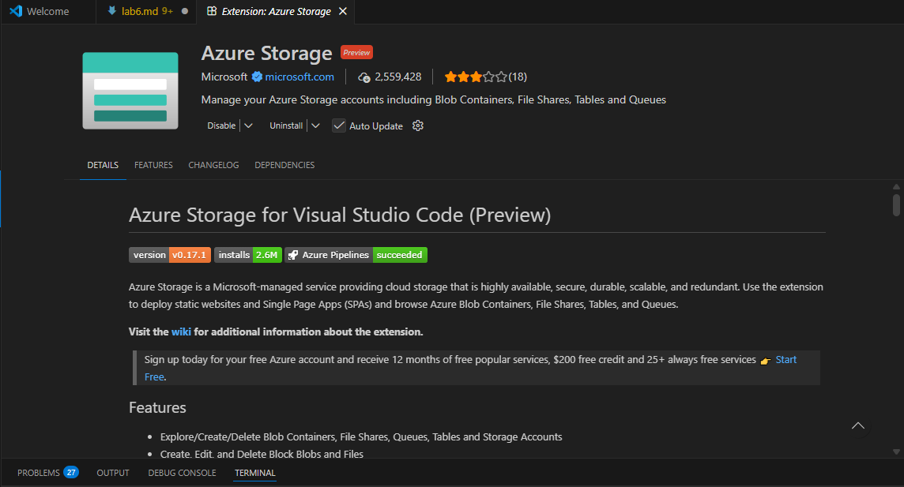
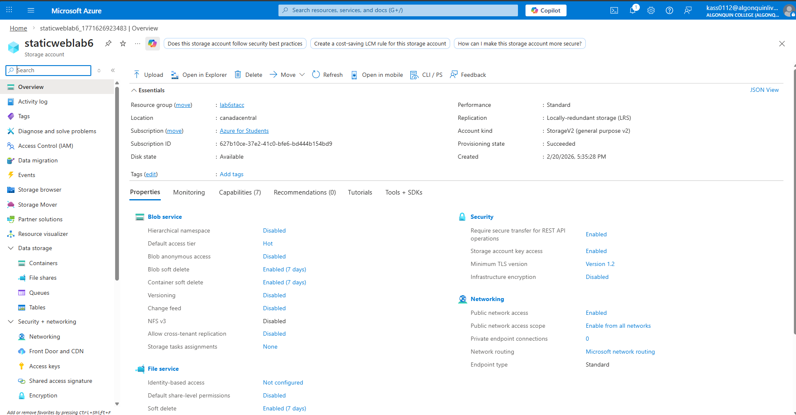
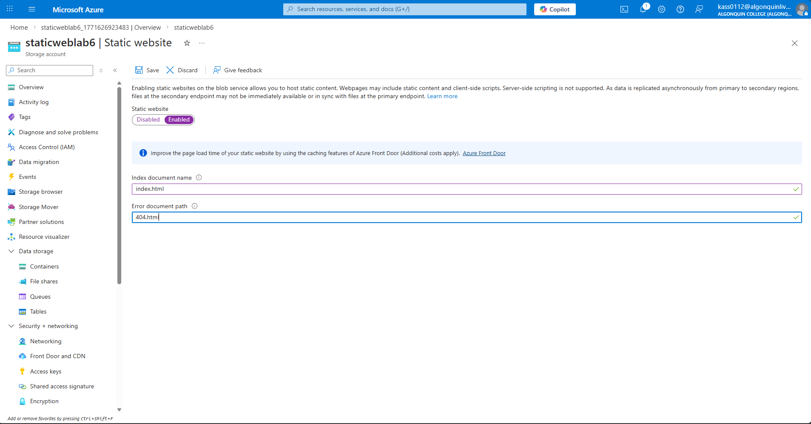
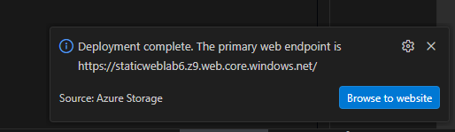
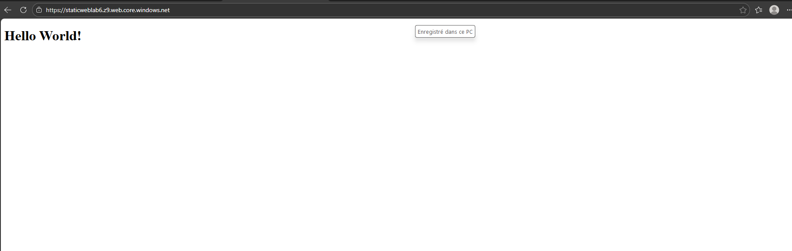
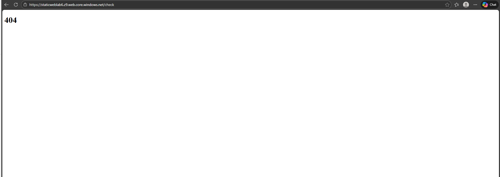
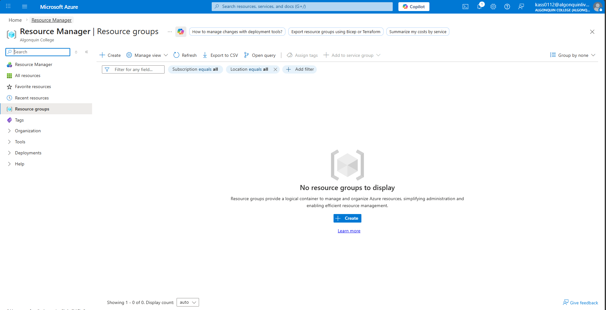

# About me 
### Full name: Anani Thierry Kassa
### Student ID: 041140713

### Lab Activity Overview:
Part A: Environment Setup
Step 1: Launch Visual Studio Code
•	Open Visual Studio Code on your computer.

Step 2: Install Azure Storage Extension
1.	Open the Extensions panel.
2.	Search for Azure Storage.
3.	Install the extension published by Microsoft.

________________________________________
Part B: Azure Portal Configuration
Step 3: Log in to Azure Portal
•	Navigate to: https://portal.azure.com
•	Sign in using your Azure account.
________________________________________
Step 4: Create a Storage Account
1.	In the Azure Portal, search for Storage accounts.
2.	Click Create.
3.	Select:
o	Subscription
o	Resource Group (create a new one if required)
4.	Enter:
o	Storage account name (must be globally unique)
o	Region (closest to your location)
5.	Leave all other settings as default.
6.	Click Review + Create, then Create.

________________________________________
Step 5: Enable Static Website Hosting
1.	Open the newly created storage account.
2.	In the left navigation pane, select Static website.
3.	Set Static website to Enabled.
4.	Configure:
o	Index document name: index.html
o	Error document path: 404.html
5.	Click Save.
Once saved, Azure will generate a Primary endpoint URL for your website.

________________________________________
Part C: Create the Static Website Locally
Step 6: Create Website Folder
1.	Create a new folder on your local machine named:
2.	mywebsite
3.	Open this folder in Visual Studio Code.
________________________________________
Step 7: Create index.html
1.	Inside the mywebsite folder, create a file named:
2.	index.html
3.	Paste the following content and save:
________________________________________
Step 8: Create 404.html
1.	Create another file named:
2.	404.html
3.	Paste the following content and save:
________________________________________
Part D: Deploy Website to Azure
Step 9: Deploy to Static Website
1.	In VS Code Explorer, right-click the mywebsite folder.
2.	Select Deploy to Static Website.
3.	Choose:
o	Azure subscription
o	Storage account you created earlier
4.	Wait for the deployment to complete.

________________________________________
Step 10: Validate Deployment
1.	Return to the Azure Portal.
2.	Open Storage Account → Static website.
3.	Click the Primary endpoint URL.
4.	Confirm:
o	“Hello World!” page loads successfully

o	Navigating to a non-existent page displays the 404 page

________________________________________
Part E: Cleanup (Mandatory)
Step 11: Delete Resources
1.	In Azure Portal, navigate to Resource Groups.
2.	Select the resource group used for this lab.
3.	Click Delete resource group.
4.	Confirm deletion.
This step ensures no unnecessary cloud resources remain active.

________________________________________
